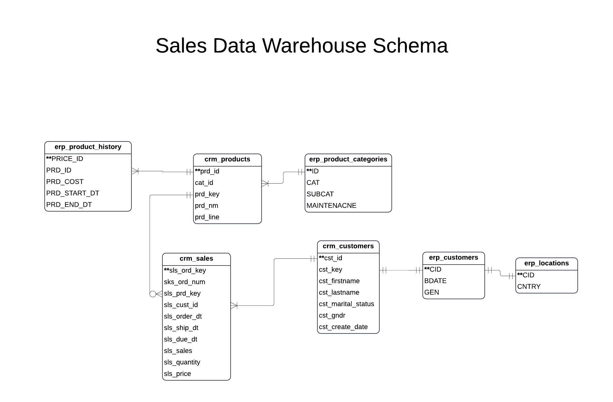

# CRM and ERP Sales Warehouse
This project builds a relational data model using CRM and ERP data representing customers, products, and sales. It demonstrates a data warehouse ETL pipeline implemented in SQL and orchestrated with Python.

### Tech Stack Used:
- SQL - sqlalchemy
- Python - pandas

### Objectives:
- Import data from CRM and ERP sources, provided as CSV files
- Perform data cleaning and resolve data quality issues
- Design a relational data model connecting all tables while preserving their original formats as much as possible

### Dataset:
Source: https://github.com/DataWithBaraa/sql-data-warehouse-project/tree/main

This dataset is split into 6 CSV files, both CRM and ERP, containing information on a company's customers, products, and orders.

### Outputs:
- Raw database: A database created by importing the CSV files as is, one table per CSV file. Data was not changed in any way.
- Relational database: A database containing the relational data model. The original tables were preserved as much as possible, with relationships between one another.

### Methodology:
Several notebooks were used throughout this project, which are meant to run in sequence. Therefore, sanity checks were included when necessary to ensure necessary actions were performed on the data.

Notebook Sequence:
- 00_load_raw
  - CSV files were loaded into raw.db. Data was not edited whatsoever at this stage.
- 01_exploration
  - Structure of the data was explored, including columns and how they relate to one another.
  - Data quality issues, such as NULLs and duplicates, were explored.
  - Each column was explored thoroughly, looking at features such as maximum and minimum value, unique and invalid values, and formatting.
- 02_transformation
  - Data was transformed based on observations made during data explorations.
  - Changes were saved as views as this was an intermediate stage and did not need to be stored long term.
- 03_validation_staging
  - Staging views were explored in order to validate that all data quality issues were resolved.
- 04_relational_model
  - Data was loaded into relational.db, specifying proper data type for each column and primary and foreign keys.
  - CRM and ERP data were kept separate as to preserve original data structure.
  - Here, one table (crm_products) was split into two separate tables to reduce data redundancy. Restructuring also improved the relational model design as it allowed for cleaner relationships to other tables.
- 05_relational_model_validation
  - Final sanity checks were performed to ensure the proper number of primary and foreign keys.
  - Table columns, column types, primary keys, and foreign keys were viewed to ensure proper structure and relations.
 
### Relational Database Structure:

### Future Work:
This project focuses on creating a usable data infrastructure for the company while preserving for them the original structure of the data. This data can be reorganized and stored in a more condense way that better supports analysis, with tables for each customers, products, and sales. This analytical data model is coming soon!

After an analytics data model is built, this model can be integrated with Tableau or PowerBI and used to build a dashboard, visualizing important business metrics such as KPIs, product performance, and sales trends.
