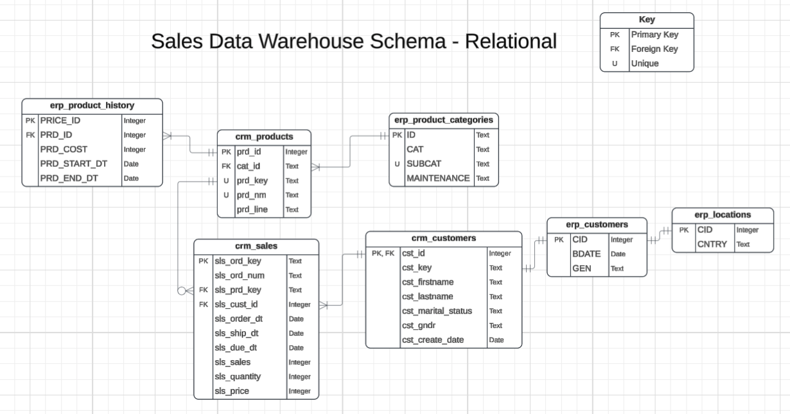
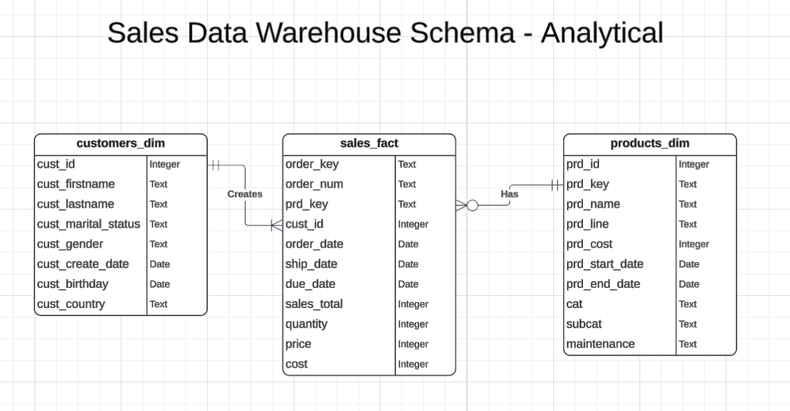
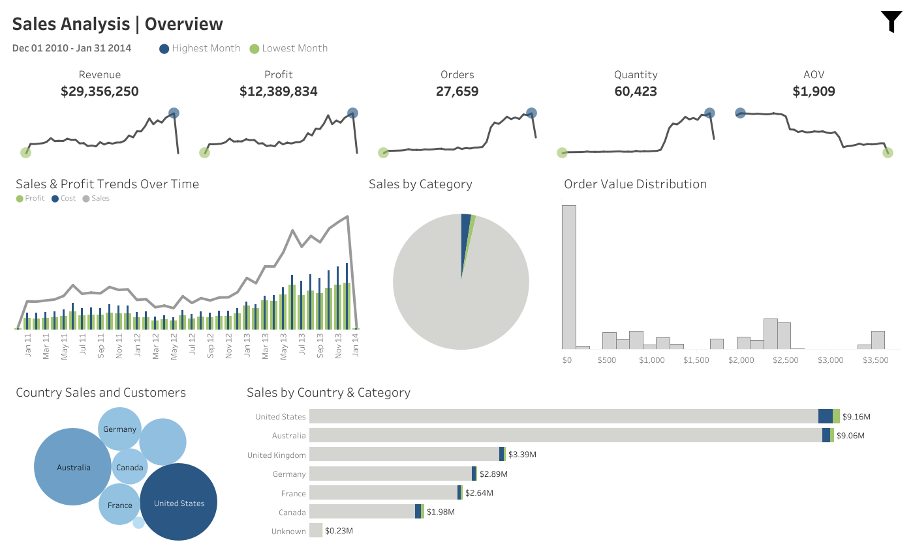

# CRM and ERP Sales Warehouse - Relational and Analytical

## Summary:
This project designs and builds relational and analytical data models from raw CRM and ERP data representing customers, products, and sales, all of which is implemented using PostgreSQL in VSCode. It includes data cleaning, transformation, validation, and the development of an ETL pipeline. Using advanced SQL queries, time-series analysis of revenue and profit were conducted to evaluate the company's performance. Crucial business insights were uncovered and recommendations made regarding their sales performance and product efficiency. 

## Table of Contents
- [Tech Stack Used](#tech-stack-used)
- [Objectives](#objectives)
- [Dataset](#dataset)
- [Scripts](#scripts)
- [Data Warehouse Outputs](#data-warehouse-outputs)
- [Relational Data Model](#relational-data-model)
- [Analytical Data Model](#analytical-data-model)
- [Key Insights](#key-insights)
- [Recommended Actions](#recommended-actions)
- [Dashboard](#dashboard)

## Tech Stack Used:
- PostgreSQL: For the DBMS, to design and implement the relational and analytical data model and ETL pipeline
- SQL: For querying and performing data exploration
- VSCode: The environment used to work with SQL files

## Objectives:
- Import data from CRM and ERP sources, provided as CSV files, into the database
- Perform data cleaning and resolve data quality issues
- Design a relational data model connecting all tables while preserving their original formats as much as possible
- Further design and implement an analytical data model to be used for data exploration and data analysis
- Analyze company's data to make recommendations based on insights uncovered

## Dataset:
Source: https://github.com/DataWithBaraa/sql-data-warehouse-project/tree/main

This dataset is split into 6 CSV files, both CRM and ERP, containing information on a company's customers, products, and orders.

## Scripts:
Several .sql files were used throughout this project, which are meant to run in sequence. Therefore, data validation files were included when necessary to ensure that the required actions were performed on the data.

Scripts Sequence and Contents:
- 00_setup
  - Three separate schemas created: raw, relational, and analytical
- 01_load_raw
  - Tables created, with appropriate columns and data types, in the raw schema
  - After table creation, data in .csv files was loaded into the respecitve tables in PostgreSQL using the "Import" feature
- 02_validating_load_raw
  - Data validation checks performed such as correct number of rows and columns and correct data types
- 03_transformation
  - Data was transformed based on observations made during data explorations
    - Changes included but not limited to:
      - Conditional data transformation
      - String manipulation (using SUBSTRING and REPLACE)
      - Date correction (using LEAD and LAG)
      - Trimming leading/trailing spaces
      - Correcting data type
      - Handling NULLs and duplicates appropriately (using COALESCE)
  - Changes were saved as views as this was an intermediate stage and did not need to be stored long term
- 04_validating_transformation
  - Data validation checks performed such as correct number of rows and columns and correct data types
- 05_relational_model
  - Tables were created in the relational schema with appropriate columns, data types, primary keys, and foreign keys
  - Data from views was inserted into the tables after data was minorly restructured in order to reduce data redundancy and allow for cleaner table relationships
  - CRM and ERP data purposely kept separate as to preserve data sturcture for the company
- 06_validating_relational_model
  - Final validation checks were performed to ensure proper data types
  - Primary and foreign keys were viewed to ensure proper structure and relations
- 07_analytics_views
  - Relational data model was restructured into an analytics-friendly data model by combining tables with sales, customer, and product information
  - Views were created containing the combined relevant data, serving as the base for the analytical data model
- 08_analytical_tables
  - Fact (sales) and dimension (products and customers) tables were created with appropriate columns and populated with the data in the analytical views
  - Resulted in three final tables that are organized in a way that reduces the number of joins required during querying
- 09_data_exploration
  - The contents of the analytical schema was explored
  - Information about the table columns was retrieved
  - Table measures (KPIs such as Total Sales, Total Products Sold, Total Customers, Average Order Total...) were explored
- 10_data_analysis
  - Data in the analytical model was queried for, looking at:
    - Total products and average product cost and total revenue, all by category
    - Top 20 revenue generating products, and the percentage of revenue they generate
    - Shipping time
  - Profit was analyzed, looking at gross margin percentage, top 20 profit-generating products, and most profitable products per unit
  - Time-Series analysis was conducted, exploring yearly and monthly revenue and profit trends

## Data Warehouse Outputs:
- Raw schema: Created by importing the CSV files as is, one table per CSV file. Data was not changed in any way. Contains 6 tables, where all column data types are "text" to prevent loss of information on import.
- Relational schema: Contains the 7 table relational data model. The original tables were preserved as much as possible, with relationships between one another. Appropriate data types were applied.
- Analytical schema: Contains 3 tables organized in a fact-and-dimension model (specifically star schema), with sales as the fact and customers and products as the dimensions. Organized in a way to reduce the number of joins required during querying for efficiency purposes.
 
## Relational Data Model:

## Analytical Data Model:

## Key Insights:
1.) **Revenue Generation by Product Type**
  - The top 20 revenue-generating products are all high-priced bikes, accounting for 63% of the company's total revenue.
  - These same products are also the top 20 profit generators
  - There is a reliance on the bike category for overall profitability, therefore **it is important for this business to maintain competitiveness in this segment**.

2.) **Underperforming Products/Categories**
  - The "Components" category shows $0 in sales, despite it having the largest number of products (127).
  - Aside from the products in the "Components" category, there are 38 other products that have not generated any sales.
  - **I recommend reviewing the possibility of discontinuing the sale of these 165 products as this could reduce inventory costs for the company**.

3.) **Product Popularity and Profitability**
  - The top 20 most popular items are mainly from the "Accessories" category, with these items generally being low-priced, suggesting that a high volume of sales is driven by affordability.
  - The top 20 products with the highest gross margin percent per item are also low priced accessories and clothing.

4.) **Sales Performance in 2013**
  - 2013 achieved an over $16M in sales, which is a 179.9% increase from 2012.
    - This increase was driven by a 6x increase in the number of orders compared to 2012, from both new and repeat customers.
    - Despite the higher volume of sales, the average order value (AOV) was lower, indicating a shift towards the lower-priced items.
    - The median and 25th percentile cost of products significantly decreased in 2013, suggesting that the company's strategy to cater to a broader customer base was a key factor in the sales spike.
  - 2013 year-over-year profit growth was 187.5% while increasing gross margin slightly, with a +1.1% margin change.
  - This may also be influenced by changed marketing strategies, such as website optimization or increased advertising.
    - This data is not available and would be something I would request and look into further to provide deeping insight.

5.) **Seasonal Trends**
  - The months of June and October through December tend to show elevated sales, with December being the best month for sales.
  - January-April are months of low sales, with February being the worst month.
  - This may be influenced by seasonal promotions, product availability, high-demand periods, or increased customer interest, which would be something to investigate in further given the data.

6.) **Overall Company Profitability**
- The company's overall gross margin is 42.21%, indicating strong profitability.
- No products were found to be selling at a loss or a breakeven price.
- High priced bikes drive the company's high revenue and profit, with lower priced accessories and clothing have high per-item profitability.

## Recommended Actions:
- Protect and strengthen the bikes category, as it drives both revenue and profit through competitive pricing, innovation, and supply.
  - Because the company is so reliant on the bikes category, a decline in this category's performance would be a huge business risk, therefore consider strengthening other categories to diversify revenue and make the company more resilient.
- Reduce inefficiencies by considering discontinuation or at the least a lower inventory for 165 products not contributing to revenue or profit.
- Recommend the popular, lower cost accessories and clothing with a high profit margin during checkout to increase the average order cost and as a result, overall profitability.
  - Consider bundles for these products if possible.
- Further investigate other potential drivers behind the 2013 spike, such as marketing strategies or website enhancement, in order to replicate tactics that were deemed successful.
- Consider increasing marketing or promotions during low-demand periods to smooth revenue across the months.

## Dashboard
A [Sales Dashboard](https://public.tableau.com/views/SalesAnalysis_17714863468170/Dashboard1?:language=en-US&:sid=&:redirect=auth&:display_count=n&:origin=viz_share_link) was built visualizing key performance indicators (KPIs), sales and profit trends, and product performance. This dashboard supports filtering by date, product, and country using either the visualizations or the collapsible filter panel.

